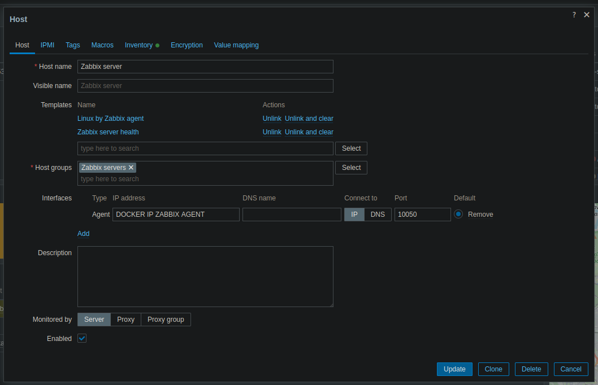
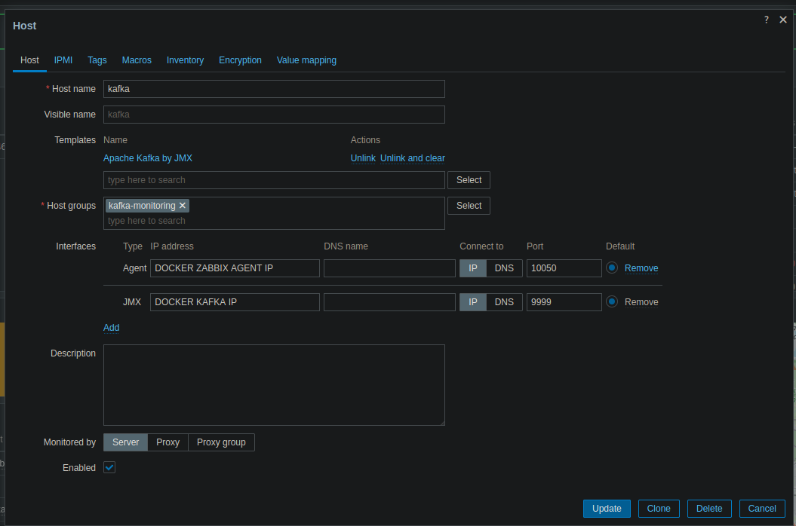

# Basic configuration of Zabbix

- At first the zabbix will not work only by upping the image from the docker.

- Create a Host with the port mentioned on the docker compose file (10050)

Use this command to show what is the ip address of the container 'zabbix-agent':

```bash
docker inspect messaging-system-zabbix-agent-1 | grep "IpAddress"
```



The same needs to be done to create the Kafka Host:


